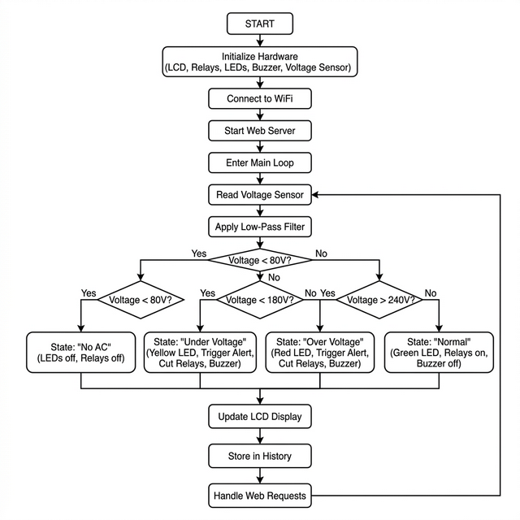
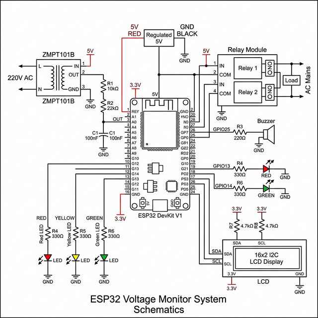
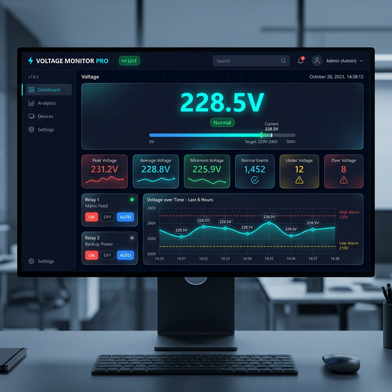

# Smart Voltage Monitor Pro

A professional ESP32-based voltage monitoring and protection system with real-time web dashboard, automatic relay control, and visual/audio alerts.


---

## Overview

Smart Voltage Monitor Pro is an industrial-grade voltage monitoring system designed to protect electrical equipment from voltage anomalies. The system continuously monitors AC voltage and automatically controls connected devices through relays when abnormal conditions are detected.

### Key Features

- **Real-time Voltage Monitoring** - Continuous AC voltage measurement with filtered readings
- **Automatic Protection** - Auto-disconnect relays during under-voltage/over-voltage events
- **Web Dashboard** - Modern, responsive web interface with live charts
- **LCD Display** - Local 16x2 LCD showing voltage and status
- **Audio Alerts** - Buzzer notifications for voltage anomalies
- **LED Indicators** - Visual status indicators (Red/Yellow/Green)
- **Configurable Thresholds** - Adjustable under-voltage, over-voltage, and no-AC detection limits
- **Statistics Tracking** - Records peak voltage, minimum voltage, and event counts
- **Manual Override** - Manual relay and buzzer control options

---

## System Architecture



---

## Hardware Requirements

### Components

| Component | Specification | Quantity |
|-----------|---------------|----------|
| ESP32 | Dev Module | 1 |
| Voltage Sensor | ZMPT101B AC Voltage Sensor | 1 |
| Relay Module | 5V 2-Channel Relay | 1 |
| LCD Display | 16x2 I2C LCD | 1 |
| Buzzer | Active Piezo Buzzer | 1 |
| LEDs | Red, Yellow, Green | 3 |
| Resistors | 220Ω (for LEDs) | 3 |

### Pin Configuration

| GPIO | Function |
|------|----------|
| 27 | Relay 1 (Channel 1) |
| 26 | Relay 2 (Channel 2) |
| 25 | Buzzer |
| 13 | Red LED |
| 12 | Yellow LED |
| 14 | Green LED |
| 34 | Voltage Sensor (Analog Input) |
| 21 | I2C SDA (LCD) |
| 22 | I2C SCL (LCD) |

---

## Circuit Diagram



---

## System Flowchart


---

## Web Dashboard

The built-in web server provides a professional dashboard with:

- **Live Voltage Display** - Real-time voltage reading with color-coded status
- **Voltage Chart** - Historical voltage graph with threshold lines
- **Relay Control** - Individual and batch control of relays (Auto/On/Off)
- **Statistics Panel** - Peak, average, and minimum voltage readings
- **Event Counter** - Track normal, under-voltage, and over-voltage events
- **Settings Panel** - Configure thresholds and reset statistics
- **System Info** - WiFi signal, uptime, memory usage



---

## Installation

### Prerequisites

- Arduino IDE or PlatformIO
- ESP32 board support installed
- Required libraries:
  - `Wire.h` (built-in)
  - `LiquidCrystal_I2C`
  - `EmonLib`
  - `WiFi.h` (built-in)
  - `WebServer.h` (built-in)
  - `Preferences.h` (built-in)

### Steps

1. **Install ESP32 Board Support**
   - Open Arduino IDE → Preferences → Additional Board Manager URLs
   - Add: `https://dl.espressif.com/dl/package_esp32_index.json`
   - Tools → Board → ESP32 → ESP32 Dev Module

2. **Install Required Libraries**
   - Library Manager → Search and install:
     - `LiquidCrystal_I2C` by Frank de Brabander
     - `EmonLib` by OpenEnergyMonitor

3. **Configure WiFi Credentials**
   ```cpp
   const char* ssid     = "YourNetworkName";
   const char* password = "YourPassword";
   ```

4. **Upload the Code**
   - Select correct COM port
   - Upload sketch

---

## Configuration

### Default Thresholds

| Parameter | Default Value | Range |
|-----------|---------------|-------|
| Under Voltage | 180V | 100-200V |
| Over Voltage | 240V | 220-280V |
| No AC Detection | 80V | 10-100V |

### Changing Thresholds

1. Access the web dashboard
2. Navigate to **Settings** tab
3. Enter new threshold values
4. Click **SAVE SETTINGS**

---

## Usage Guide

### Status Indicators

| LED Color | Status |
|-----------|--------|
| Green | Normal voltage (180V - 240V) |
| Yellow | Under voltage (< 180V) |
| Red | Over voltage (> 240V) |
| Off | No AC connected |

### Relay Modes

- **Auto**: Relay automatically turns off during voltage anomalies
- **On**: Relay always stays on (manual override)
- **Off**: Relay always stays off (manual override)

### Accessing Web Dashboard

1. Connect to the same WiFi network
2. Find the ESP32 IP address (shown on LCD)
3. Open browser: `http://<ESP32_IP_ADDRESS>`

---

## Project Structure

```
smart_helmet/
├── smart_helmet.ino      # Main Arduino sketch
├── images/
│   ├── circuit_diagram.png   # Hardware connection diagram
│   ├── system_flowchart.png  # Operation flowchart
│   └── web_dashboard.png     # Dashboard screenshot
└── README.md            # This file
```

---

## Technical Details

### Voltage Measurement

- Uses ZMPT101B AC voltage sensor
- ADC reading with emonLib calibration
- Exponential moving average filtering (70% old + 30% new)
- Sampling: 20 cycles, 2000ms timeout

### Data Storage

- Threshold settings saved to ESP32 flash memory
- Persistent across power cycles

### Web Server

- Built-in ESP32 WebServer on port 80
- RESTful API endpoint `/livedata` for JSON data
- Auto-refresh every 1 second
- Chart.js for voltage history visualization

---

## Troubleshooting

### Common Issues

| Issue | Solution |
|-------|----------|
| WiFi not connecting | Verify SSID and password, check signal strength |
| Voltage reading inaccurate | Adjust calibration in `emon.voltage()` function |
| LCD not displaying | Check I2C address (default 0x27), verify wiring |
| Relays not working | Verify GPIO connections, check relay module power |

---

## Future Enhancements

- [ ] OTA (Over-the-Air) firmware updates
- [ ] MQTT integration for IoT platforms
- [ ] Email/SMS alerts
- [ ] Data logging to SD card
- [ ] Mobile app support
- [ ] Cloud dashboard

---

## License

This project is open source and available under the MIT License.

---

## Author

**SAM** 
- Project: Smart Voltage Monitor Pro
- Platform: ESP32
- Version: 1.0.0

---

## Acknowledgments

- [EmonLib](https://github.com/openenergymonitor/EmonLib) - Energy monitoring library
- [ESP32 WebServer](https://github.com/espressif/arduino-esp32) - Web server implementation
- [Chart.js](https://www.chartjs.org/) - Beautiful charts for the web

---

*For technical support and questions, please refer to the project documentation.*
