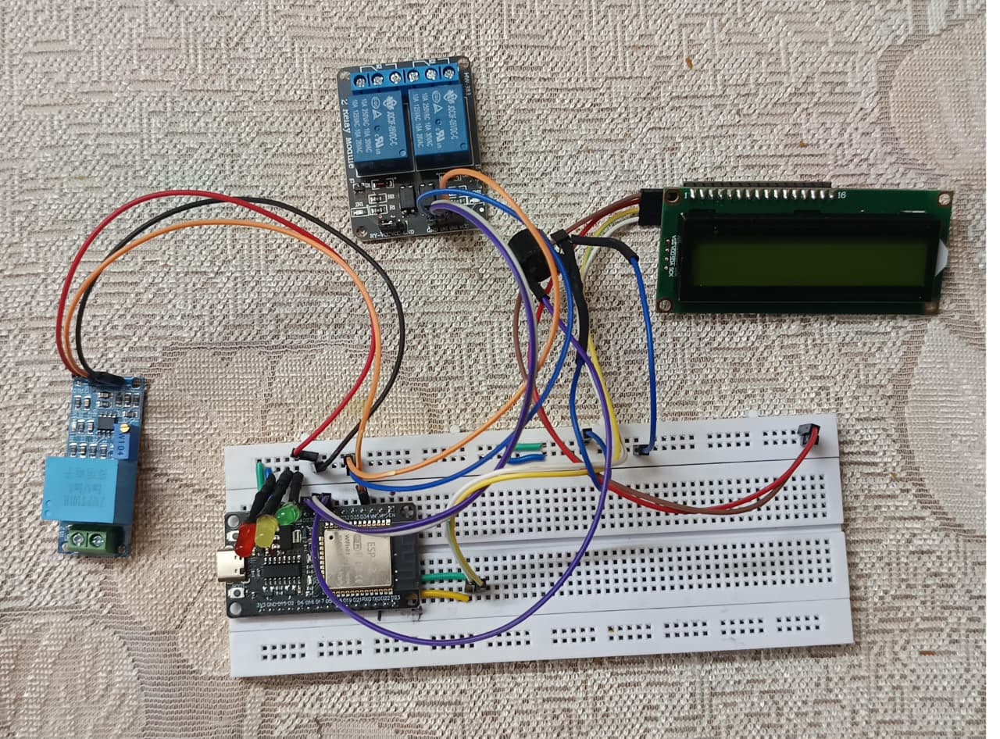
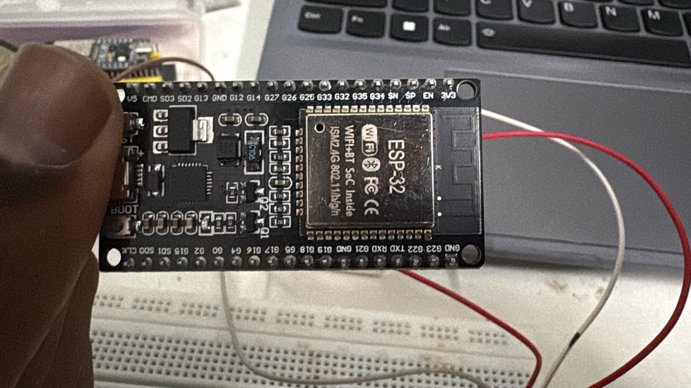
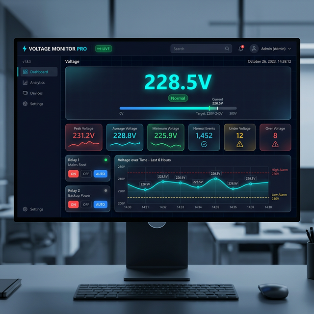
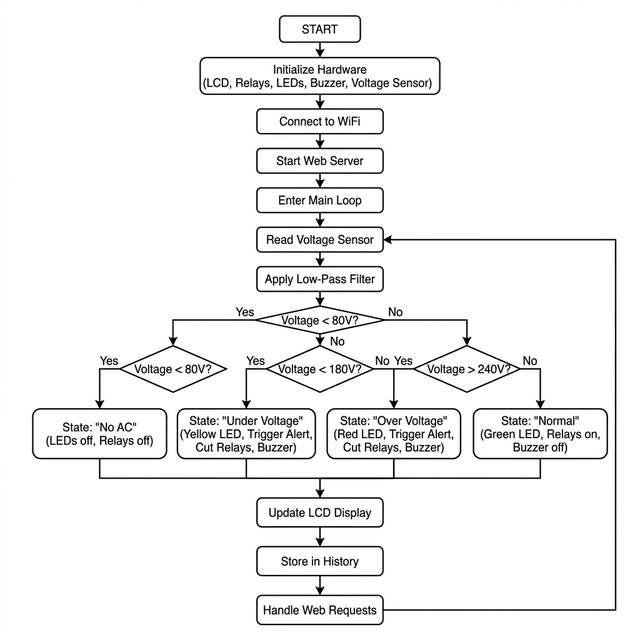
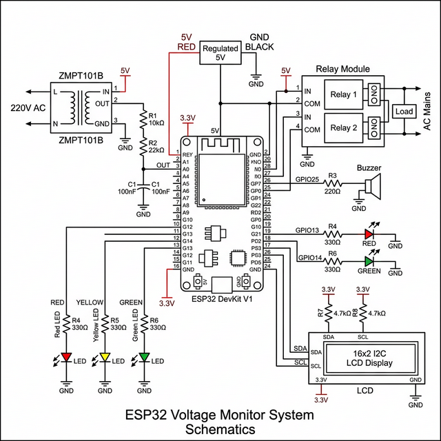

# AC High Low Protecting System Using ESP32 with Webpage

> A smart AC voltage protection system built on ESP32 that monitors mains voltage in real time, automatically disconnects the load during over-voltage or under-voltage conditions, and exposes a beautiful live web dashboard over WiFi.

This repo contains **two separate versions** of the system:

| | [ESP32 + Web Dashboard](#esp32-version) | [Arduino Nano Standalone](#arduino-nano-version) |
|---|---|---|
| Board | ESP32 (WiFi) | Arduino Nano / UNO |
| Display | 16×2 I²C LCD + browser dashboard | 16×2 I²C LCD |
| Control | Web UI + automatic | Automatic only |
| Code | [`voltage_monitor.ino`](voltage_monitor.ino) | [`arduino_nano/over_under_voltage_protection.ino`](arduino_nano/over_under_voltage_protection.ino) |

---

## Project Demo



### Test Setup



### Demo Video

<video controls src="images/project_demo.mp4" style="max-width:100%;" poster="images/project_demo.jpg">
  Your browser does not support the video tag.
  <a href="images/project_demo.mp4">Download the demo video</a>
</video>

---

## Reference

This project is based on the **Overvoltage And Undervoltage Protection System** reference design:

- Full tutorial & guide: [circuitdiagrams.in — Overvoltage And Undervoltage Protection System Using Arduino](https://circuitdiagrams.in/overvoltage-and-undervoltage-protection-system/)
- Uses the **ZMPT101B** voltage sensor with **EmonLib** for accurate RMS measurement
- Trips a relay (isolating the load) when voltage falls below **180 V** or rises above **240 V**

---

# ESP32 Version

> Smart monitor with live web dashboard, dual relay output, simulation demo mode, and persisted settings.

## Dashboard Preview

The built-in web interface runs entirely on the ESP32 — no cloud, no app required.  
Open any browser on the same WiFi network and navigate to the device IP address.



---

## Key Features

- **Automatic Over-Voltage Protection** — disconnects load when voltage exceeds threshold (default: 240 V)  
- **Automatic Under-Voltage Protection** — disconnects load when voltage drops below threshold (default: 180 V)  
- **Dual Relay Output** — protect two independent loads simultaneously  
- **3-Color LED Indicator** — Red (over), Yellow (under), Green (normal)  
- **Audible Buzzer Alert** — with mute option via the web UI  
- **16×2 I²C LCD Display** — shows live voltage and status without WiFi  
- **Persistent Settings** — thresholds saved to ESP32 flash (NVS), survive reboot  
- **Responsive Web Dashboard** — dark-mode, mobile-friendly, no external server needed  
- **Test Lab (Simulation Mode)** — inject voltages, run wave patterns, one-shot sequences from the browser
- **Demo Mode** — automated hardware cycle (all LEDs + relays + buzzer)

---

## System Architecture



---

## Hardware Required (ESP32)

| Component | Qty | Notes |
|---|---|---|
| ESP32 Dev Board | 1 | Any 30-pin or 38-pin variant |
| ZMPT101B Voltage Sensor Module | 1 | Calibrated for AC mains |
| 5V 2-Channel Relay Module | 1 | Active-LOW trigger |
| 16×2 I²C LCD (0x27) | 1 | HD44780 + PCF8574 backpack |
| Red LED | 1 | Over-voltage indicator |
| Yellow LED | 1 | Under-voltage indicator |
| Green LED | 1 | Normal / stable indicator |
| Active Buzzer Module | 1 | Or passive buzzer with transistor driver |
| BC547 NPN Transistors | 4 | Driver for LEDs and buzzer |
| 220 Ω Resistors | 3 | LED current limiting |
| 1 kΩ Resistors | 4 | Transistor base resistors |
| 10 kΩ Resistor | 1 | ADC input bias for ZMPT101B |
| 100 Ω Resistor | 1 | ADC input series resistor |

---

## Pin Connections (ESP32)

```
ESP32 GPIO  →  Component
────────────────────────────────
GPIO 21     →  LCD SDA
GPIO 22     →  LCD SCL
GPIO 34     →  ZMPT101B OUT  (via 100 Ω series + 10 kΩ to GND)
GPIO 27     →  Relay Module IN1
GPIO 26     →  Relay Module IN2
GPIO 25     →  BC547 Base (1 kΩ) → Buzzer collector
GPIO 13     →  BC547 Base (1 kΩ) → Red LED (220 Ω) collector
GPIO 12     →  BC547 Base (1 kΩ) → Yellow LED (220 Ω) collector
GPIO 14     →  BC547 Base (1 kΩ) → Green LED (220 Ω) collector
3.3 V   →  ADC sensor VCC, LCD VCC (via I²C backpack)
5 V     →  Relay VCC
GND     →  Shared Ground
```

---

## Circuit Diagram



---

## Software Setup (ESP32)

### Required Libraries

Install all via **Sketch → Include Library → Manage Libraries**:

| Library | Author |
|---|---|
| `EmonLib` | OpenEnergyMonitor |
| `LiquidCrystal I2C` | Frank de Brabander |

`WiFi.h`, `WebServer.h`, and `Preferences.h` are all included with the ESP32 core.

### Configuration

Open `voltage_monitor.ino` and edit the WiFi credentials:

```cpp
const char* ssid     = "YOUR_WIFI_NAME";
const char* password = "YOUR_WIFI_PASSWORD";
```

### Upload

1. Connect your ESP32 via USB
2. Select the correct board and port in Arduino IDE
3. Click **Upload** (sketch is in [`voltage_monitor.ino`](voltage_monitor.ino))
4. Open **Serial Monitor** at 115200 baud
5. Note the IP address printed
6. Navigate to that IP in any browser on the same WiFi network

---

## Web API Endpoints

| Endpoint | Description |
|---|---|
| `/` | Main web dashboard |
| `/livedata` | JSON: voltage, status, relay states, alerts |
| `/histdata` | JSON: last 60 voltage readings for the chart |
| `/r1on` `/r1off` `/r1auto` | Relay 1 manual control |
| `/r2on` `/r2off` `/r2auto` | Relay 2 manual control |
| `/bothon` `/bothoff` `/bothauto` | Both relays at once |
| `/buzzeron` `/buzzeroff` `/buzzermute` | Buzzer control |
| `/savesettings?under=180&over=240` | Save thresholds settings |

---

# Arduino Nano Version

> A standalone low-cost Overvoltage And Undervoltage Protection System for Arduino Nano / UNO, built with the ZMPT101B sensor and EmonLib.

This is the classic Arduino-only design from the reference article. It detects any AC voltage below **180 V** or above **240 V**, trips the relay to disconnect the load from mains, shows live voltage on an I²C LCD, and drives a buzzer + LED warning during fault conditions.

## Key Features

- **Automatic load disconnection** on over / under voltage
- **Live RMS voltage display** on 16×2 I²C LCD
- **Buzzer + LED** warning during under / over voltage
- **Low cost** — Arduino + ZMPT101B sensor + relay
- **Calibration support** for accurate mains readings

## Hardware Required (Arduino)

| Component | Qty | Notes |
|---|---|---|
| Arduino Nano / UNO| 1 | |
| ZMPT101B Voltage Sensor | 1 | Or 9V AC transformer + divider |
| 5V Relay Module | 1 | Active-LOW trigger |
| 16×2 I²C LCD (0x27) | 1 | Runs the display |
| Buzzer | 1 | Optional |
| 5V LED | 1 | Optional warning lamp |
| Wires | – | |

## Pin Connections (Arduino)

```
Arduino pin     →  Component
─────────────────────────────────
A0 (Nano)       →  Sensor OUT
D10 (Nano)      →  Relay IN
D9              →  Buzzer (+)
D8              →  LED anode (via 220 Ω)
SDA/SCL (A4/A5) →  LCD I²C
5 V             →  Module VCC
GND             →  Shared GND
```

## Uploading

The Arduino Nano sketch is [`arduino_nano/over_under_voltage_protection.ino`](arduino_nano/over_under_voltage_protection.ino).

Calibration method for voltage:

- Upload the sketch and open **Serial Plotter** (Tools → Serial Plotter) at 9600 baud
- Adjust the trimmer on the circuit board until a clean sinusoidal-like waveform appears
- Trim `emon.voltage(A0, 234.0, 1.7)` — the `234.0` is your reference supply voltage and `1.7` the calibration constant; tweak them for accurate RMS readings.

---

## Safety Warning

> **This project deals with mains AC voltage (110 V / 220 V), which is lethal.**  
> Ensure all high-voltage wiring is done by a qualified person.  
> Use appropriate enclosures, insulation, and circuit breakers.  
> The sensor module (ZMPT101B etc.) provides isolation from mains — do not bypass it.  
> This project is for educational and hobbyist use only.

---

## Project Structure

```
smart-voltage-monitor/
├── voltage_monitor.ino            # ESP32 sketch (WiFi + Web dashboard)
├── arduino_nano/
│   └── over_under_voltage_protection.ino   # Arduino Nano standalone code
├── README.md
├── .gitignore
└── images/
    ├── circuit_diagram.png
    ├── system_flowchart.png
    ├── web_dashboard.png
    ├── project_demo.jpg          # Project photo
    ├── test_setup.jpg           # Test setup photo
    └── project_demo.mp4         # Demo video
```

---

## License

This project is released under the [MIT License](LICENSE).

---

## Author

**Sam Joseph**

---

*Built for real-world AC protection. Open source. No cloud required.*